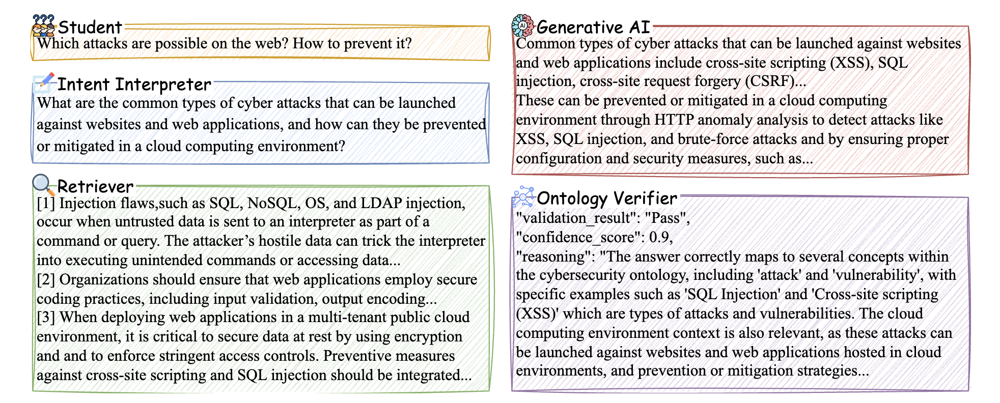
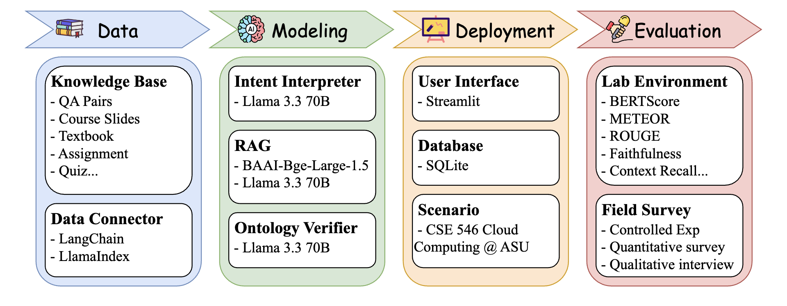
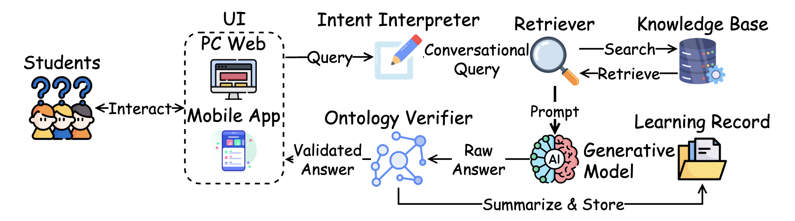

# 🛡️ CyberBOT

CyberBOT is an AI-powered educational assistant that supports university students in learning **Cybersecurity** and **Cloud Computing** through question answering, ontology validation, and follow-up contextualization.

This repo hosts the demo for the **ACL 2025** paper using only the **Cybersecurity QA dataset**, curated from:  
🔗 [AISecKG Cybersecurity Dataset](https://github.com/garima0106/AISecKG-cybersecurity-dataset)

---

## 🔍 What Makes CyberBOT Unique?

✅ **Ontology-based Answer Validation**  
✅ **Intent Rewriting for Follow-up Questions**  
✅ **Domain-Specific Context Retrieval from QA Pairs**  

CyberBOT enhances standard RAG pipelines by verifying answers using domain-specific knowledge and adapting to conversational context.

---

## 💡 End-to-End Use Case



---

## 🧠 System Pipeline



---

## 🧩 Full Stack Overview



---

## 🧱 System Components

| Component         | Model Name                                    | Purpose                                                    |
|------------------|-----------------------------------------------|------------------------------------------------------------|
| **Embedding**     | `BAAI/bge-large-en-v1.5`                       | Vector search via FAISS (query/document matching)         |
| **Answering**     | `meta-llama/Llama-3.3-70B-Instruct-Turbo`      | Generates responses to user questions                      |
| **Intent Rewrite**| `meta-llama/Llama-3.3-70B-Instruct-Turbo`      | Rewrites follow-ups into standalone questions              |
| **Validation**    | `meta-llama/Llama-3.3-70B-Instruct-Turbo`      | Validates answer against ontology, returns Pass/Fail       |

---

## 📁 Project Structure

```
CyberBOT/
├── backend/             # FastAPI backend
│   ├── api.py
│   ├── answer_retriever.py
│   ├── llm_infer.py
│   ├── ontology_validator.py
│   ├── auth.py, db.py, models.py, routes.py
│   └── utils.py, config.py
│
├── frontend/            # Streamlit app
│   ├── main.py
│   └── pages/
│       ├── access.py
│       └── chat.py
│
├── dataset/             # Ontology + QA pairs
│   └── ontology/
│       ├── ontology.txt
│       └── ontology.csv
│
├── qapair-embedder.py   # Embedding script for QA pairs
├── faiss_index.py       # Index builder script using FAISS
├── requirements.txt     # Python dependencies
└── README.md
```

---

## ⚙️ Setup Instructions

### 1. Clone the Repo

```bash
git clone https://github.com/rccrdmr/CyberBOT.git
cd CyberBOT
```

### 2. Set Up Environment

```bash
python -m venv venv
source venv/bin/activate
pip install -r requirements.txt
```

### 3. Add Together API Key

```bash
export TOGETHER_API_KEY="your-api-key-here"
```

### 4. Embed QA Dataset

```bash
python qapair-embedder.py
```

### 5. Run Backend

```bash
cd backend
uvicorn api:app --reload
```

### 6. Run Frontend

```bash
cd frontend
streamlit run main.py
```

---

## 🧠 Dataset & Validation

- **QA Pairs**: From the [AISecKG Cybersecurity Dataset](https://github.com/garima0106/AISecKG-cybersecurity-dataset)
- **Ontology**: Used to validate LLM-generated answers and enforce alignment with domain-specific concepts

---

## 📌 Notes

Although this repo demonstrates the system on **cybersecurity**, our full demo also includes a separate Cloud Computing domain powered by PDF course materials — showing flexibility across **multiple RAG data sources**.

## 📑 Citation

```tex
@misc{zhao2025cyberbotreliablecybersecurityeducation,
      title={CyberBOT: Towards Reliable Cybersecurity Education via Ontology-Grounded Retrieval Augmented Generation}, 
      author={Chengshuai Zhao and Riccardo De Maria and Tharindu Kumarage and Kumar Satvik Chaudhary and Garima Agrawal and Yiwen Li and Jongchan Park and Yuli Deng and Ying-Chih Chen and Huan Liu},
      year={2025},
      eprint={2504.00389},
      archivePrefix={arXiv},
      primaryClass={cs.AI},
      url={https://arxiv.org/abs/2504.00389}, 
}

@article{zhao2024ontology,
  title={Ontology-Aware RAG for Improved Question-Answering in Cybersecurity Education},
  author={Zhao, Chengshuai and Agrawal, Garima and Kumarage, Tharindu and Tan, Zhen and Deng, Yuli and Chen, Ying-Chih and Liu, Huan},
  journal={arXiv preprint arXiv:2412.14191},
  year={2024}
}
```

---

## 
